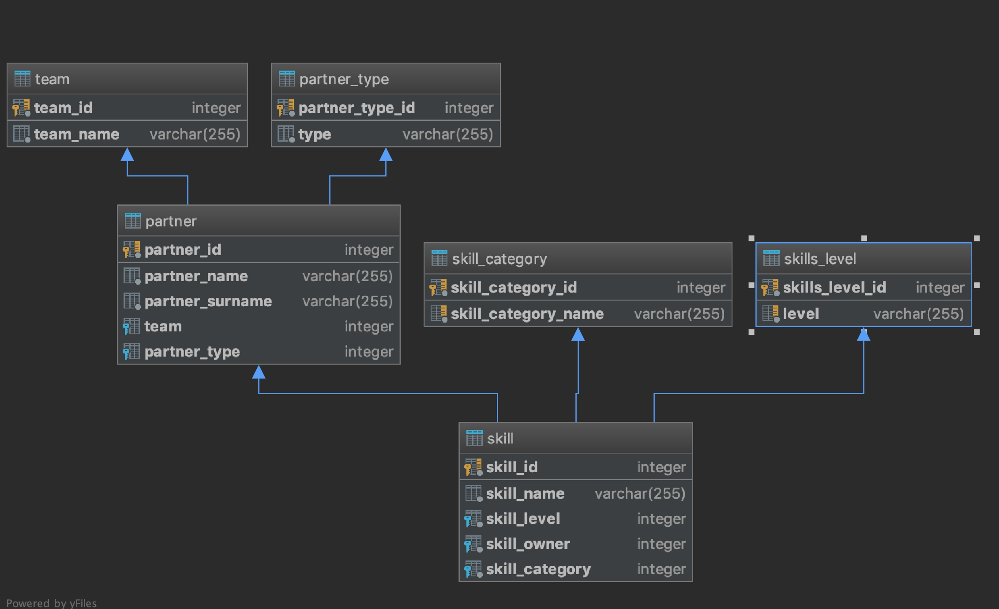

# To run application localy

* use this vm argument: 
--spring.profiles.active=dev

# Swagger-UI
/swagger-ui.html

# DATA BASE 
* we are using Postgres Database for prod
* For dev and Test Profile we are using in memory H2

